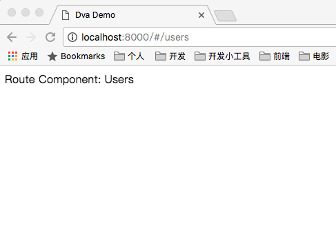
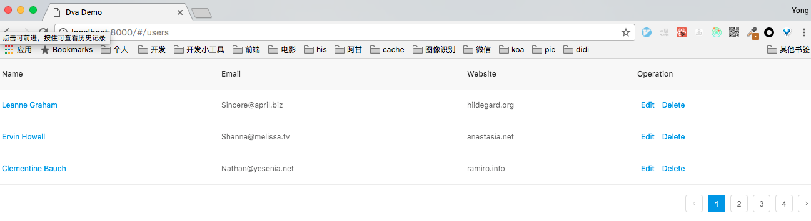

# dva2.0 教程
## 跳过教程直接查看页面效果
1. clone代码
```bash
git clone https://github.com/ssehacker/examples.git
```

2. 进入dva2工作目录
```bash
cd examples/dva2.0/demo1
```

3. 安装依赖
```bash
npm i
```

4. 查看效果
浏览器访问 [http://localhost:8000/#/users](http://localhost:8000/#/users)


## 一步一步操作

#### 1. 参照如下教程

[dva1.x教程](https://github.com/sorrycc/blog/issues/18)
一步步操作，一直到`Step 3. 配置代理，能通过 RESTFul 的方式访问 `
> 启示和dva1 差别不大

#### 2. 添加users路由
由于目前脚手架不支持dva2.x添加路由，这里手动添加

a. 编辑 `src/router.js`文件，更改如下：
```javascript
import React from 'react';
import { Router, Route, Switch } from 'dva/router';
import IndexPage from './routes/IndexPage';

// 引入Users依赖
import Users from "./routes/Users.js";

function RouterConfig({ history }) {
  return (
    <Router history={history}>
      <Switch>
        <Route path="/" exact component={IndexPage} />
        <Route path="/users" component={Users} />
      </Switch>
    </Router>
  );
}

export default RouterConfig;

```

b. 新建文件`src/routes/Users.js`， 内容如下：
```javascript
import React from 'react';
import { connect } from 'dva';

function Users() {
  return (
    <div className={styles.normal}>
      Route Component: Users
    </div>
  );
}

function mapStateToProps() {
  return {};
}

export default connect(mapStateToProps)(Users);
```

然后，访问 [http://localhost:8000/#/users](http://localhost:8000/#/users)，就可以看到如下：

 
 

#### 3. 继续参考原教程中 
> 注意：step6中原教程有误， `src/models/users.js`文件中：
subscriptions 应该为如下，为query添加默认值，否则会报错。
```javascript
subscriptions: {
    setup({ dispatch, history }) {
      return history.listen(({ pathname, query={} }) => {
        if (pathname === '/users') {
          dispatch({ type: 'fetch', payload: query });
        }
      });
    },
  },
```

浏览器访问[http://localhost:8000/#/users](http://localhost:8000/#/users)，就可以看到如下：


#### 4. 继续参考原教程直到结束

